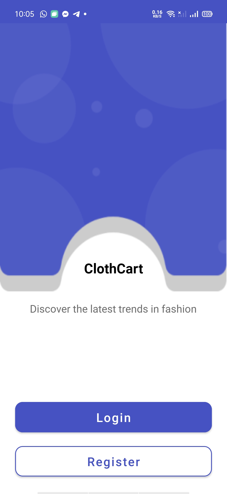
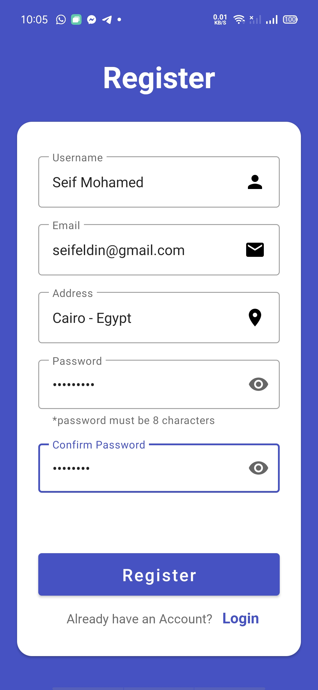
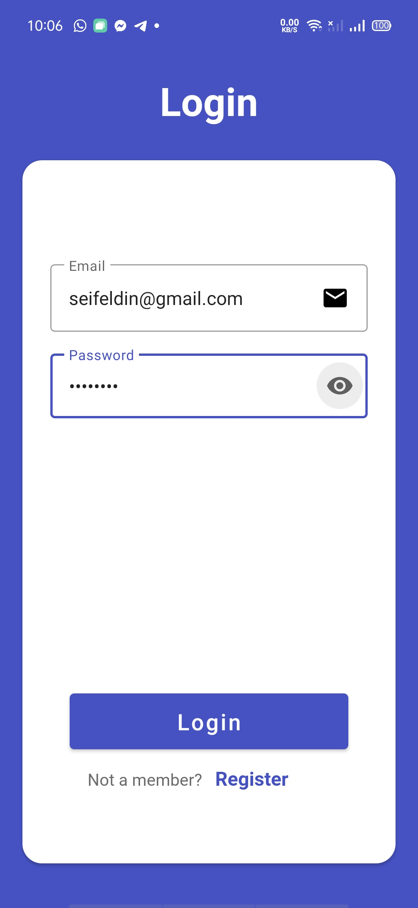
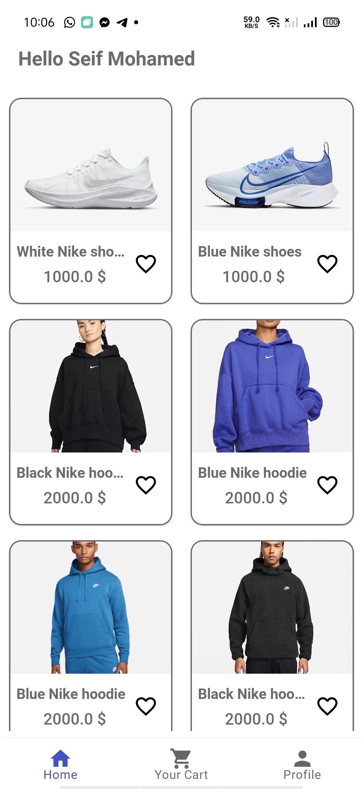
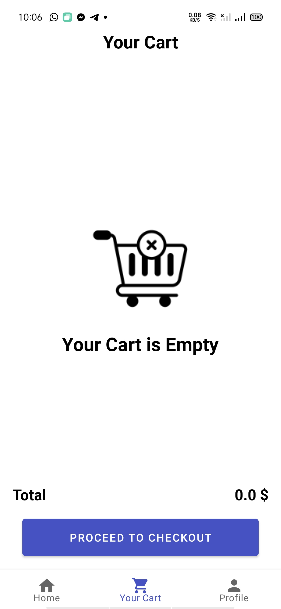
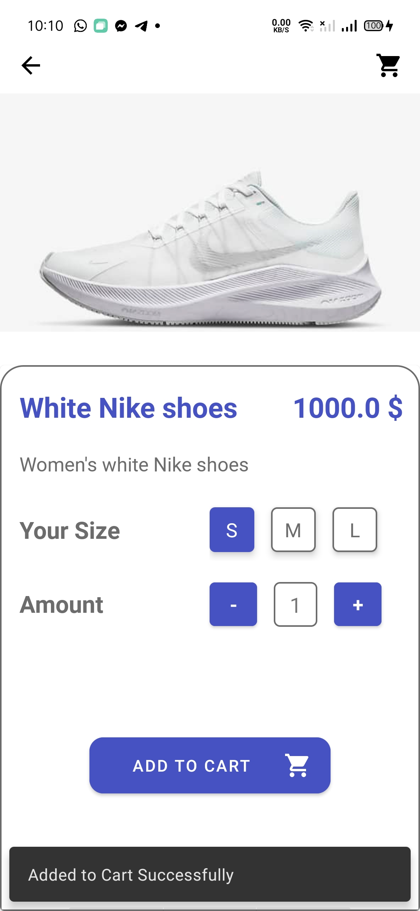
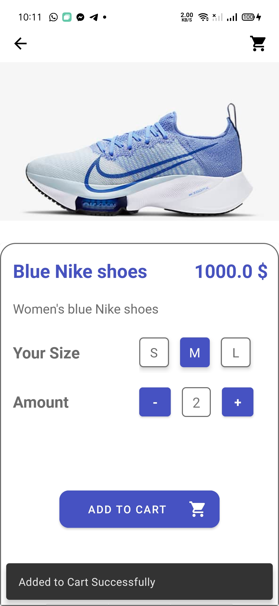
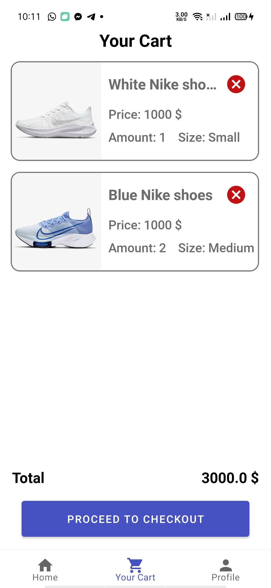
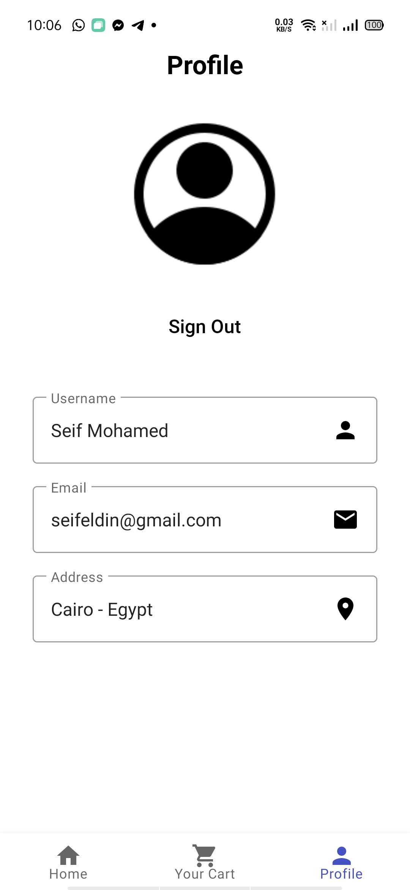

# ClothCart
### App screenshots

  
  
  
  
  
  
  
  
  
  

### Built With:
• Kotlin  
• MVVM Architecture  
• Dependency Injection - Dagger-Hilt  
• Navigation Component  
• ROOM Database  
• Retrofit  
• Kotlin Coroutines  
• Shared Preference  
• Live Data  
• Flow   
• View Binding  
• Recycler View + DiffUtil  
• Picasso  

### MVVM Code Architecture:

  

### Features:

●	User Can Create an Account and then Login to our app. 
●	The app fetch the products from our backend server through api that requires user's token. 
●	When the user clicks on a product he navigates to see product details then he can choose amount and size of this product to add it to his cart.  
●	The app calculates the total price for user orders and user can delete an order from his cart.  
● Finally user can see his profile information and can logout.

